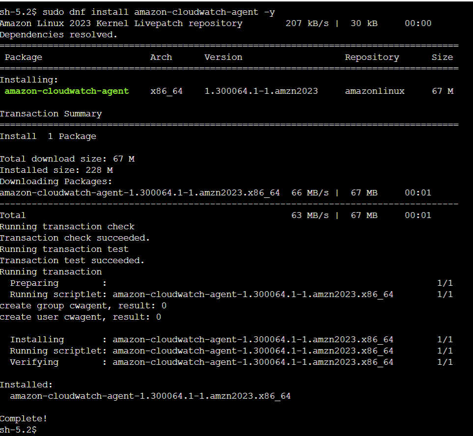
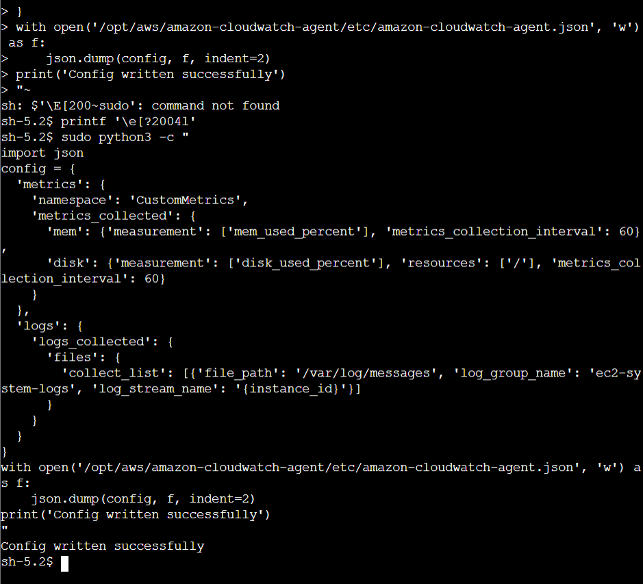
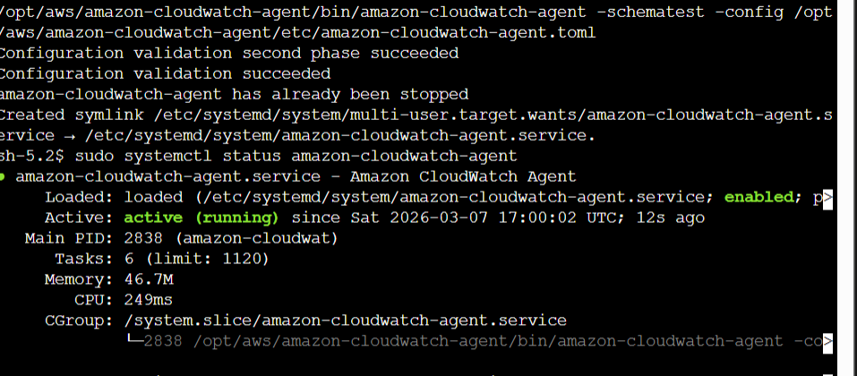
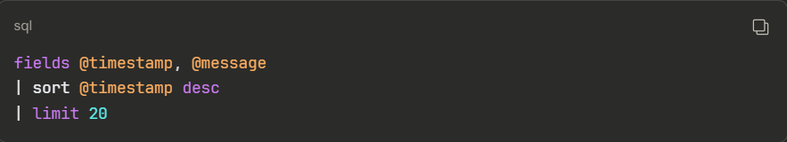
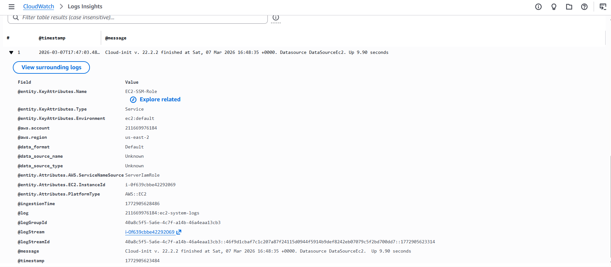
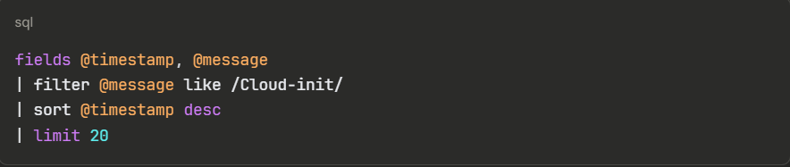
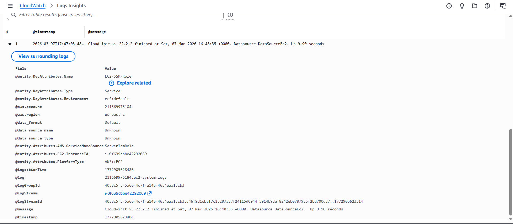

# Lab 04 – CloudWatch Agent + Logs Insights

## Objective
Install and configure the CloudWatch Agent to collect custom 
metrics (memory, disk) and stream logs to CloudWatch Logs. 
Query logs using Logs Insights.

## Services Used
- Amazon EC2 (Amazon Linux 2023, t2.micro)
- CloudWatch Agent
- Amazon CloudWatch Metrics
- CloudWatch Logs
- CloudWatch Logs Insights
- AWS Systems Manager (Session Manager + Run Command)
- AWS CloudShell

## Architecture
```
EC2 Instance (EC2-SSM-Role)
  → CloudWatch Agent
      → CustomMetrics namespace (mem, disk) → CloudWatch
      → /var/log/cloud-init-output.log → ec2-system-logs log group
          → Logs Insights queries
```

## What I Built

### Step 1 – Install CloudWatch Agent
Installed the CloudWatch Agent on Amazon Linux 2023 via SSM Session Manager.



### Step 2 – Create Config File
Due to SSM bracketed paste mode limitations, the config file was 
written using a Python script via SSM Run Command from CloudShell.
Config defines memory and disk metrics plus log streaming.



### Step 3 – Verify Agent Running
Confirmed agent is active and running with correct config loaded.



### Step 4 – Query Logs with Logs Insights
Selected log group ec2-system-logs and ran queries against 
streaming cloud-init logs.

**Query 1 – All logs newest first:**





**Query 2 – Filter by content:**





## IAM Role Requirements
| Policy | Purpose |
|--------|---------|
| AmazonSSMManagedInstanceCore | SSM Session Manager access |
| CloudWatchAgentServerPolicy | Publish metrics and logs to CloudWatch |

IAM Role used instead of IAM User — temporary credentials only.
Never place IAM user access keys on EC2 instances.

## Key Concepts Learned
- Memory and disk are NOT default CloudWatch metrics
- CloudWatch Agent bridges the gap — collects OS-level data
- IAM roles provide temporary credentials — never use 
  IAM users with access keys on EC2 instances
- Amazon Linux 2023 uses systemd-journald — no /var/log/messages
- Log groups contain log streams (one per instance)
- Logs Insights time range set in UI, not in query syntax
- CloudTrail = who did what / CloudWatch Logs = query and filter

## Troubleshooting Encountered
- SSM Session Manager bracketed paste mode blocked heredoc 
  input — resolved using CloudShell + boto3 SSM Run Command
- Agent running but no metrics publishing — CloudWatchAgentServerPolicy 
  was missing from IAM role — added via CLI, metrics appeared
- /var/log/messages missing on Amazon Linux 2023 — AL2023 uses 
  systemd-journald, switched to /var/log/cloud-init-output.log

## Exam Relevance
- Domain 1: Monitoring, Logging, Analysis, Remediation (22%)
- Missing CloudWatchAgentServerPolicy = silent metric failure
- IAM roles for EC2, never access keys on instances
- Logs Insights for incident response and log analysis
- CloudTrail + Logs Insights = complete investigation toolkit
```

---